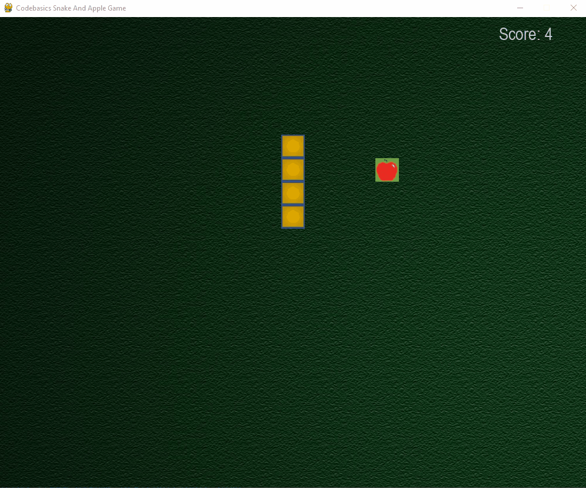

## Snake and Apple Game
Building snake and apple game in `pygame and python`

## 🛠️ Description

Snake and apple is a simple game where when snake eats an apple it gets longer and your score increases. If you snake hits any part of its body it will die.

## ⚙️ Languages or Frameworks Used

You only need Python to run this script. You can visit [here](https://www.python.org/downloads/) to download Python
You also need to install <i>pip install pygame</i> in the terminal to run the program

## 🌟 How to run

Running the script is really simple! Just open a terminal in the folder where your script is located and run the following command:

